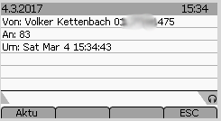

# asterisk-snom-pickup-info-xml-agi
AGI tool for asterisk to display the caller-id-info for pickup on phones not ringing. Replaces the chronically broken "notifycid" feature of chan_sip

## Motivation
After 10 years of asterisk and snom phones, I was frustrated by the all time broken "notifcid" features of chan_sip.
This feature is supposed to send the caller-id information of a call ringing on some other phone
to the phone that is able to pickup the call because it has a subscription on the ringing extension.

One common problem of notifycid in asterisk is, that - for some reason - the call cannot be found inside
asterisk and therefore the callerid-informationen sent to the subsribing phone contains the destination
extension as the caller id of the calling party. The nom phone will show "82 => 82" noth beeing
the internal extension which is complete nonsense.
You'll find several issues in the asterisk bug tracker.
The problems with this feature where fixed in some versions somewhere between 1.8 and 12 but are broken
again in recent versions.
That's why I decided ti diable notifycid and write an AGI script to do the job.

My thanks go to Chris Maciejewski <chris@level7systems.co.uk> who wrote a very useful sip library in php,
that I use to generate the sip-notifys for the snom phones.

See the screenshot for a impression what the script will display on the snom (370) phone:

Beware: this script does not honor subscriptions or any other "security" features of for voip systems.
Called as an AGI, it will send callerid information to any phone in your network.
You don't need a subscription, but if you don't have one, you won't be able to pickup the call.
So this script is just an addon to configuring subscriptions and pickup for your snom phones.

On the snom phone, you need to set:

Support broken Registrar to "on"
Filter Packets from Registrar to "off"
Network identity (port): 5060
Clear Desktop Message on Cancel --> "off" -> message stays permanently --> "on" -> message can be deleted via "Cancel" key

The script needs a valid identity of the phone receiving the notify as it's only argument.
The info will be displayed no matter what idenity is active.

# License
Please see file LICENSE
For the LICENSE of the php-sip library, this tool is based on see LICENSE.PhpSIP
